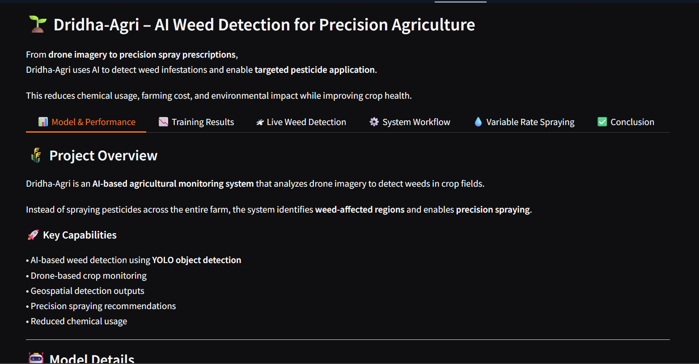
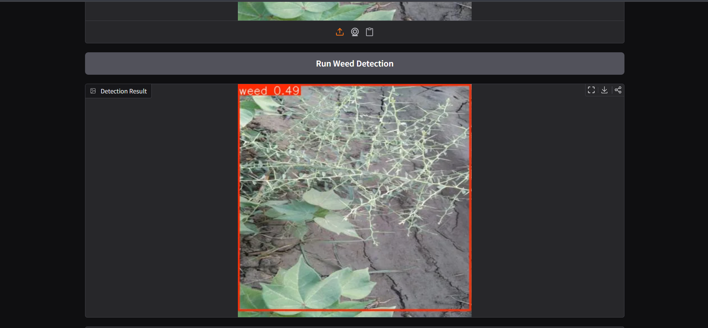
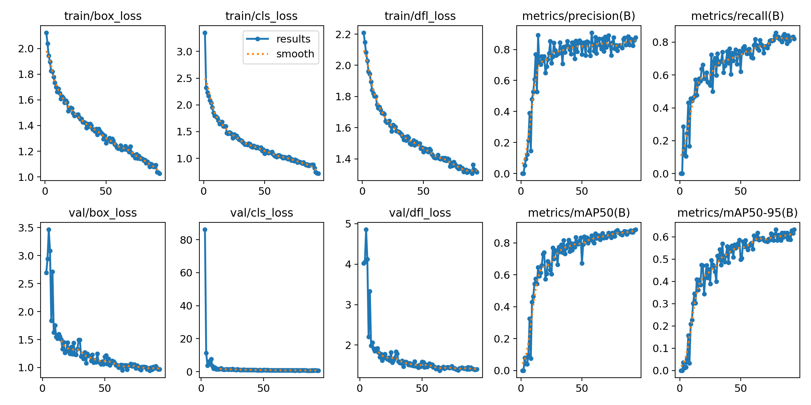

# 🌱 Dridha-Agri: AI Weed Detection for Precision Agriculture

Dridha-Agri is an AI-powered agricultural monitoring system that detects weed infestations in crop fields using drone imagery and computer vision.

The system enables **precision agriculture** by identifying weed clusters and recommending **variable-rate pesticide spraying**, reducing unnecessary chemical usage and improving crop health.

---

# 🚀 Live Demo

🔗 https://huggingface.co/spaces/Lirisha123/Dridha

---

# 📌 Project Highlights

* AI-based weed detection using **YOLOv11**
* Drone imagery analysis for agricultural monitoring
* Precision spraying recommendations
* Cloud-based image processing pipeline
* Interactive web demo deployed on Hugging Face Spaces

---

# 🖥️ Application Interface

### Main Interface



---

### Weed Detection Example



---

### Model Training Results



---

# 🤖 Model Details

| Feature       | Details                             |
| ------------- | ----------------------------------- |
| Model         | YOLOv11 (Small)                     |
| Task          | Weed Detection from Drone Imagery   |
| Dataset       | 3295 annotated images               |
| Training      | 96 epochs with augmentation         |
| Crops Covered | Paddy, Cotton, Sugarcane, Groundnut |

---

# 📊 Model Performance

| Metric       | Value  | Description                                    |
| ------------ | ------ | ---------------------------------------------- |
| Precision    | 90.88% | Percentage of predicted weeds that are correct |
| Recall       | 85.84% | Percentage of actual weeds detected            |
| mAP@0.5      | 88.45% | Detection accuracy at IoU threshold 0.5        |
| mAP@0.5:0.95 | 63.27% | Strict detection accuracy                      |

---

# ⚙️ System Workflow

1️⃣ Drone missions capture aerial crop images.

2️⃣ Images automatically synchronize to the cloud along with geo-referenced data.

3️⃣ The uploaded images are processed by the AI weed detection model.

4️⃣ The model detects weed clusters within crop regions.

5️⃣ Detection outputs are converted into geospatial outputs.

6️⃣ Results are used to guide **precision pesticide spraying operations**.

This workflow enables scalable crop monitoring and data-driven agricultural decisions.

---

# 💧 Variable Rate Spraying

Dridha-Agri recommends spraying intensity based on weed density.

| Weed Density | Spray Level |
| ------------ | ----------- |
| Low          | 1–3         |
| Medium       | 4–7         |
| High         | 8–10        |

Benefits:

* Reduced pesticide usage
* Lower farming costs
* Improved crop productivity
* Environmentally sustainable agriculture

---

# 🛠️ Tech Stack

**Machine Learning**

* YOLOv11
* PyTorch

**Frameworks**

* Gradio
* Ultralytics

**Libraries**

* OpenCV
* NumPy

**Deployment**

* Hugging Face Spaces

---

# 📂 Project Structure

```
dridha_ML
│
├── app.py
├── best.pt
├── requirements.txt
├── results.png
├── README.md
└── screenshots
    ├── ui_overview.png
    ├── detection_example.png
```

---

# 👩‍💻 Author

**Lirisha Reddy**

AI-based Precision Agriculture Project
